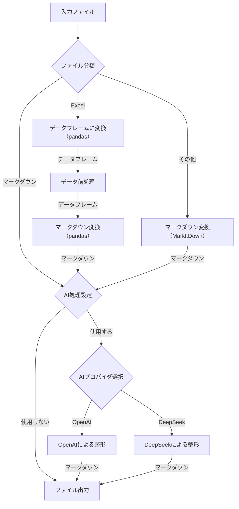

# Marcell - マークダウン変換ツール

Marcellは様々なファイル形式（Excel、Word、PowerPoint、PDF）をマークダウンに変換し、オプションでAI処理によって整形するツールです。

## 特徴

- 多様なファイル形式をマークダウンに一括変換
- OpenAI または Deepseek AIを使用したマークダウンの高度な整形
- 単一ファイルおよびディレクトリの一括処理に対応
- 並列処理による高速な変換とAI処理

## 処理フロー


## インストール

### 必要条件

- Python 3.12以上
- 必要なPythonパッケージ（requirements.txtからインストール可能）

```bash
pip install -r requirements.txt
```

### セットアップ

1. リポジトリをクローン:

```bash
git clone https://github.com/y-miyaz/marcell.git
cd marcell
```

2. 環境変数を設定（`.env`ファイルを作成するか、システム環境変数を設定）:
OpenAI API, DeepSeek APIの設定及び、生成AIによるフォーマット対象の拡張子を環境変数に定義します。
```
# OpenAI API Key - Replace with your actual key
OPENAI_API_KEY=your_openai_api_key_here

# OpenAI Model to use
OPENAI_MODEL=o3-mini

# API Request rate limit (seconds between requests)
OPENAI_RATE_LIMIT_DELAY=1.0

# OpenAI Max Tokens
OPENAI_MAX_TOKENS=8192

# DeepSeek API Key
DEEPSEEK_API_KEY=your_deepseek_api_key_here

# DeepSeek Model to use
DEEPSEEK_MODEL=deepseek-chat

# API Request rate limit (seconds between requests)
DEEPSEEK_RATE_LIMIT_DELAY=1.0

# DeepSeek Max Tokens
DEEPSEEK_MAX_TOKENS=8192

# AI format Supported Extension
AI_SUPPORTED_EXTENSIONS=.xlsx,.xls,.xlsm
```

3. コマンドラインから実行できるようにする:

#### Unix/Linux/Mac:
```bash
chmod +x bin/marcell
ln -s "$(pwd)/bin/marcell" /usr/local/bin/marcell
```

#### Windows (PowerShell):
```powershell
# PowerShellプロファイルにパスを追加
Add-Content $profile "`$env:Path += ';$(pwd)\bin'"
```

## 使用方法

### 基本的な使い方

#### 単一ファイル変換:

```bash
marcell -i input.xlsx -o output.md
```

#### ディレクトリ内のファイルを一括変換:

```bash
marcell -d input_directory -o output_directory
```

### AIフォーマット機能

OpenAIまたはDeepseekのAIを使用してマークダウンを美しく整形できます:

```bash
marcell -i input.xlsx --use-ai --ai-provider openai
```

```bash
marcell -d input_directory --use-ai --ai-provider deepseek
```

### コマンドラインオプション

```
引数:
  -h, --help            ヘルプメッセージを表示して終了
  -i INPUT, --input INPUT
                        入力ファイルパス
  -d DIRECTORY, --directory DIRECTORY
                        変換するファイルを含むディレクトリ
  -o OUTPUT, --output OUTPUT
                        出力先のパス。ファイルの場合: 出力マークダウンファイルのパス。
                        ディレクトリの場合: 出力ディレクトリのパス。
                        ディレクトリで指定されない場合、'{directory_name}_md'が使用されます
  --no-titles           マークダウンにシート/データ名をタイトルとして含めない
  --use-ai              AIを使用してマークダウン出力を拡張・整形する
  --ai-provider {openai,deepseek}
                        フォーマットに使用するAIプロバイダ (デフォルト: openai)
  --prompts-file PROMPTS_FILE
                        異なるファイルタイプのプロンプトを含むYAMLファイルへのパス
```

## サポートされているファイル形式

- Excel (.xlsx, .xls, .xlsm)
- Word (.docx)
- PowerPoint (.pptx)
- PDF (.pdf)
- Markdown (.md) - 生成AIによるフォーマットのみ

## プロンプト設定

`prompts.yaml`ファイルにファイル拡張子ごとのAIプロンプトを定義できます。
変換するファイルに応じて変更してください:

```yaml
default:
  system: "You are a markdown formatting expert."
  user: "Format the following markdown content:\n\n{content}"

excel:
  system: "You are an expert in formatting Excel data as clean markdown tables."
  user: "Format the following Excel data as a well-structured markdown document, ensuring tables are properly aligned:\n\n{content}"

docx:
  system: "You are an expert in formatting Word documents as clean markdown."
  user: "Convert this Word document content to well-structured markdown, preserving headings, lists, and emphasis:\n\n{content}"
```

## ライセンス

MITライセンス (LICENSE.txtを参照)
